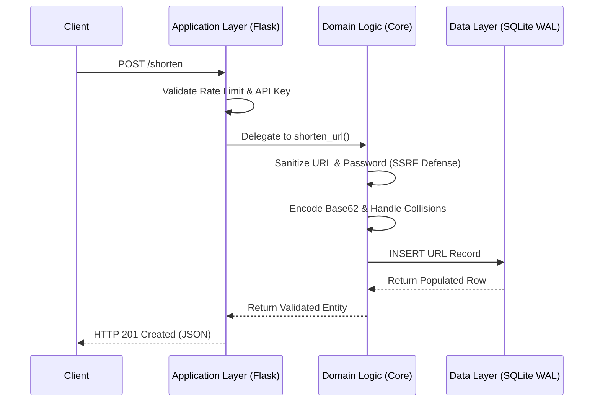

# URL Shortener

A high-performance URL shortener designed with a focus on simplicity, speed, and strict security constraints. Built using zero-dependency standard libraries wherever possible, this application delivers a robust backend wrapped in a highly responsive, modern interface.

## Architecture & Data Flow

This application uses an **Optimized Monolith** architecture. By strictly bounding dependencies (Flask, Gunicorn) and relying on a Write-Ahead Logging (WAL) SQLite implementation, it achieves high single-node throughput and predictable memory footprints without the overhead of external caching or complex microservices.



## Core Features

- **Guest vs. Authenticated Access**: Guests can generate standard permanent links. Authenticated users unlock custom aliases, link expiration, and password-protected links.
- **Robust Security**: Built-in SSRF (Server-Side Request Forgery) defenses strictly block loopback and internal network requests via precise string parsing.
- **In-Memory Rate Limiting**: A zero-dependency, thread-safe sliding window rate limiter protects endpoints against abuse, managing quotas dynamically based on the authentication tier.
- **Modern UI/UX**: The frontend is a Vanilla JavaScript Single Page Application (SPA) utilizing the View Transitions API for seamless navigation, subtle glassmorphism, and Geist typography. It strictly uses DOM node manipulation (`textContent`) to eliminate XSS vulnerability surfaces.
- **Administrative Dashboard**: A dedicated interface for global moderation and user management.

## Tech Stack


## Quickstart (Docker)

The application is fully containerized for a streamlined production deployment. Because the rate limiter state is stored in memory, the application is configured to run a single worker process with multiple threads (`gunicorn --workers=1 --threads=4`).

### Prerequisites
- Docker & Docker Compose

### Running the Application

1. **Clone the repository:**
   ```bash
   git clone https://github.com/your-org/url-shortener.git
   cd url-shortener
   ```

2. **Build and start the container:**
   ```bash
   docker-compose up --build -d
   ```

3. **Access the application:**
   Navigate to `http://localhost:5000` in your browser. The SQLite database will be automatically initialized on the first run.

## Testing

An extensive integration and adversarial testing suite is provided. To run the tests locally:

```bash
python -m pytest
```