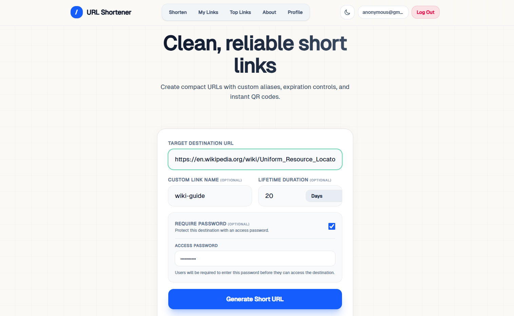

# URL Shortener

  
[Live Application Link](https://jatinpanigrahy.pythonanywhere.com/)

A simple, fast, and secure URL shortening application. It relies on standard libraries to keep dependencies low while delivering a reliable backend and a responsive user interface.

## Architecture

This application uses a standard monolith architecture. By keeping external dependencies to a minimum (using Flask and Gunicorn) and relying on SQLite in Write-Ahead Logging (WAL) mode, it handles concurrent read and write operations effectively without requiring a complex database setup.

## Core Features

- **Access Controls**: Unauthenticated users can generate basic links. Authenticated users can create custom aliases, set link expiration dates, and protect links with passwords.
- **Security**: Includes built-in defenses against Server-Side Request Forgery (SSRF) by blocking internal network requests. It also safely handles all data rendering on the client side to prevent Cross-Site Scripting (XSS).
- **Rate Limiting**: An in-memory, thread-safe rate limiter protects API endpoints from abuse. It assigns different request quotas depending on whether the user is a guest or authenticated.
- **Administrative Interface**: A dedicated dashboard allows administrators to manage users and moderate links.

## Core API Endpoints

The backend exposes a RESTful API for programmatic access:

- `POST /shorten`: Generate a new short URL. Accepts optional parameters for custom aliases, TTL (expiration), and link passwords.
- `PATCH /<short_code>`: Update the destination URL of an existing link (requires authentication).
- `GET /<short_code>`: Redirects to the original URL. Handles password-protected links by validating the `X-Link-Password` header.
- `DELETE /<short_code>`: Deletes a specific link (requires authentication or admin privileges).

## Tech Stack

- **Backend**: Python 3.10+, Flask
- **Database**: SQLite
- **Frontend**: Vanilla JavaScript, HTML, CSS

## Local Development (Without Docker)

You can run the application directly on your machine using standard Python tooling.

### Prerequisites

- Python 3.10 or higher

### Setup

1. **Clone the repository:**

   ```bash
   git clone https://github.com/your-org/url-shortener.git
   cd url-shortener
   ```

2. **Create and activate a virtual environment:**

   ```bash
   python -m venv .venv
   source .venv/bin/activate  # On Windows use: .venv\Scripts\activate
   ```

3. **Install dependencies:**

   ```bash
   pip install -r requirements.txt
   ```

4. **Run the application:**

   ```bash
   flask --app src/app run --debug
   ```

   Navigate to `http://localhost:5000` in your browser.

## Quickstart (Docker)

For a production-like environment, the application is containerized. It is configured to run a single Gunicorn worker process with multiple threads to properly share the in-memory rate limiter state.

1. **Build and start the container:**

   ```bash
   docker-compose up --build -d
   ```

2. **Access the application:**
   Navigate to `http://localhost:5000`.

## Testing

A suite of integration tests is provided to ensure backend reliability. To run the tests locally:

```bash
python -m pytest
```

## Deployment

This application is currently deployed and hosted on [PythonAnywhere](https://www.pythonanywhere.com/).

You can view the live application here: [Insert Live Link Here](https://jatinpanigrahy.pythonanywhere.com/)
